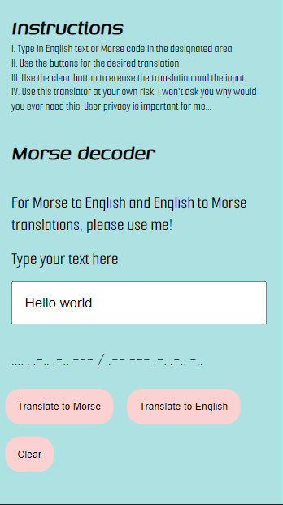
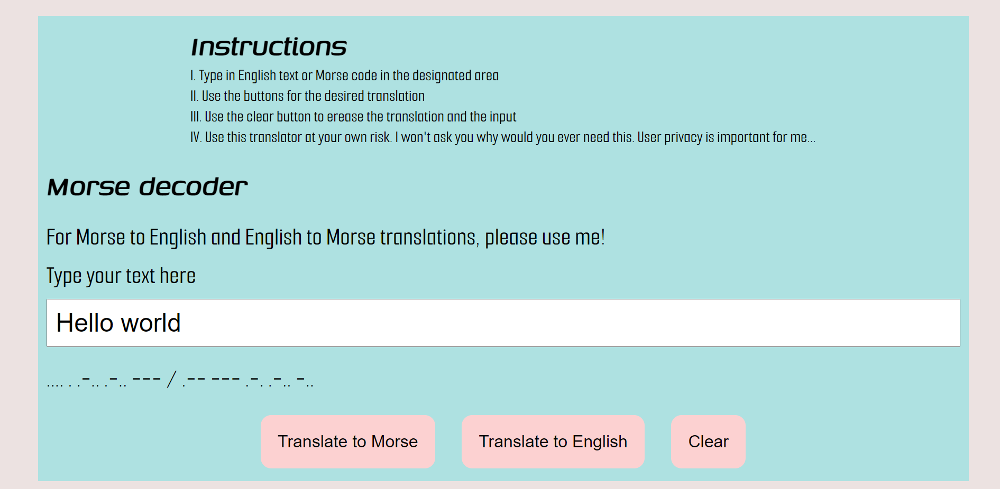

# MORSE CODE TRANSLATOR

This project was part of a tech test done at nology. It tested my understanding of JavaScript fundamentals, unit testing with @jest, DOM manipulation, HTML and  SASS (SCSS), as well as getting practice using command line and GitHub flow.

ABOUT 
===
The morse code translator was created with:

* UI Design: HTML and SASS ( SCSS and then compiled to CSS, BEM notation for SASS)
* Functionalty : JavaScript 
* Unit testing with JEST, following the TDD sofware developemnt process

It has a responsive design for :

* Mobile devices up to 768px
* Tablets and small laptops up to 1024px
* PC monitors or larger devices from 1024px

My inspiration for the design and functionality comes from :

* Funcitonality: https://morsedecoder.com/
* Color palette: https://colorhunt.co/palette/fcd1d1ece2e1d3e0dcaee1e1 

FUNCTIONALITY
===

This morse translator can be used as follows:

* Read the instructions
* Type the desired text to be translated
* For Morse-English translations: click the "Translate to English" button
* For English-Morse translations: click the "Translate to Morse" button
* Clear the translations with "clear" button for a new input.

FEATURES
===
With this morse translator you can:

* Translate text from English to morse code and viceversa
* Clear the input text and the output translation 

PREVIEW
===
Mobile device:  

 
Tablet device:  

 
PC monitor or larger:  

